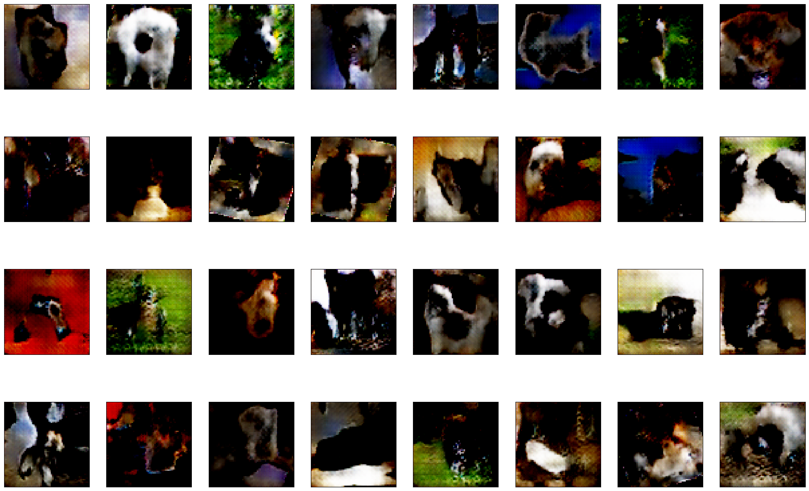

# Отчёт по лабораторной работе
## Свёрточные нейронные сети

### Студенты: 

| ФИО       | Роль в проекте                     | Оценка       |
|-----------|------------------------------------|--------------|
| Меджидли Исмаил Ибрагим оглы | Выполнил всю работу |          |

> *Комментарии проверяющего*

## Задание №1. Pet Faces
Мною была создана сверточная нейронная сеть (CNN), которая на основе датасета Pet Faces обучилась решать задачи классификации:
* Определение кошки или собаки (бинарная классификация)
* Определение породы кошки или собаки (мультиклассовая классификация)

Датасет был скачан с помощью следующего скрипта:
```python
def download_and_extract_dataset(url, target_path):
    subprocess.run(['wget', url])
    subprocess.run(['tar', 'xfz', 'petfaces.tar.gz'])
    subprocess.run(['del', 'petfaces.tar.gz'], shell = True)
    print(f"Dataset extracted to {target_path}")

#URL и путь для датасета
url = 'http://www.soshnikov.com/permanent/data/petfaces.tar.gz'
target_path = 'petfaces'
download_and_extract_dataset(url, target_path)
```
Мой код использует предобученную модель ResNet18 для извлечения признаков и добавляет два линейных классификатора для решения задач классификации пород и бинарной классификации кошек и собак. Тренировка модели (вычисление потерь и обновление весов) состоит из 10 эпох.

Оценка модели показывает достаточно неплохие результаты:
```
Breed Classification Accuracy:  0.8320373250388803
Binary Classification Accuracy:  0.895800933125972
Top-3 Accuracy: 97.20%
```
Также в файле "Faces.ipynb" представлена Confusion matrix (матрица ошибок) — это таблица, которая используется для оценки производительности алгоритма классификации. Она показывает, насколько точно CNN определяет породы кошек и собак. В jupyter-журнале показан результат работы модели (определение питомца, его породы по фото). Например, нейронная сеть правильно определила персидскую кошку:


## Задание №2. Oxford Pets и Transfer Learing

Чтобы решить эту задачу создаются три сверточные нейронные сети: с предобученной моделью VGG-16, с VGG-19, с ResNet50. Каждая из них прошла обучение, состоящее из 10 эпох. Лучше всего оказалась оценка модели с VGG-16. Ее я и стал использовать для решения задания.

Далее я создаю и обучает сверточную нейронную сеть для бинарной классификации изображений кошек и собак, используя предобученную модель VGG-16: фотографии из датасета Oxford Pets делятся на тренировочный и тестовый наборы: 80% для тренировки, остальное - для теста. Модель учится на тренировочных данных, её точность проверяется на тестовых данных. Точность двоичной классификации "кошки против собак" оказывается равна 92%. Оценка точности определения породы показывает приемлемые результаты:

```
Top-3 Accuracy: 0.8010825439783491
Top-5 Accuracy: 0.6928281461434371
```

Кроме того, я построил Confusion matrix и выполнил визуализацию зон интереса, на которые "смотрит" нейросеть при определении классов при помощи алгоритма GrandCam. Визуализация зон интереса:


С результатами всей работы можно ознакомиться в журнале "Pets.ipynb".

## Задание №3. Генерация изображений

Мною была создана генеративно-состязательная сеть для генерации изображений животных на основе датасета Oxford Pets. Генератор создает изображения по примеру фото из датасета. Генератор получает обратную связь от дискриминатора (который отличает реальные фотографии от "фейковых" - сгенерированных), пытается улучшить свои результаты до тех пор, пока дискриминатор не сможет отличить сгенерированные фото от реальных. К сожалению, не на всех сгенерированных фото, можно отличить собаку или кошку, но фотографии, где это возможно сделать, тоже присутствуют в немалом количестве. С результатами работы можно ознакомиться в журнале "GAN.ipynb" и архиве "generated_images.zip". Сгенерированные изображения имеют размера 64x64 пикселя. Вот некоторые из них:



# Вывод

В ходе выполнения второй лабораторной работы курса "Искусственный Интеллект" я значительно углубил свои знания в области сверточных нейронных сетей (CNN). Я научился решать задачи классификации изображений, освоил создание и обучение генеративно-состязательных сетей (GAN) для генерации изображений. Надеюсь, эти навыки и знания будут полезны мне в будущем для решения различных задач в области машинного обучения и компьютерного зрения.